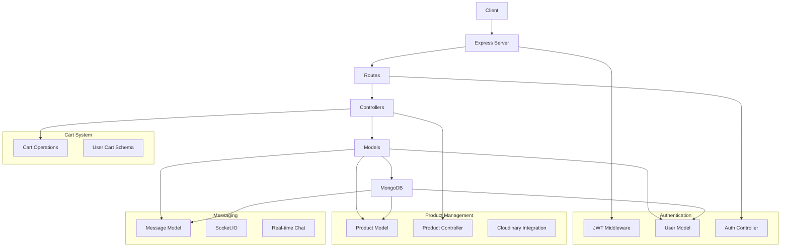

# Backend Architecture Documentation

## System Overview

The backend is built using Node.js with Express.js framework and MongoDB as the database. It follows a RESTful architecture with proper separation of concerns.

## Architecture Diagram



## Key Components

### 1. Authentication System
- JWT-based authentication
- User roles (admin/user)
- Secure password hashing with bcrypt
- Protected routes middleware
- Profile management with Cloudinary integration

### 2. Product Management
- CRUD operations for products
- Image upload using Cloudinary
- Role-based access control
- Product categorization and filtering

### 3. Cart System
- User-specific cart management
- Product quantity updates
- Cart persistence in database

### 4. Real-time Messaging
- Socket.IO integration
- Message persistence
- User-to-user communication
- Real-time updates

## Database Schema

### User Schema
```javascript
{
    email: String,
    fullName: String,
    password: String,
    profilePic: String,
    role: String,
    cart: [{
        productId: ObjectId,
        quantity: Number
    }]
}
```

### Product Schema
```javascript
{
    name: String,
    description: String,
    price: Number,
    imageUrl: String,
    user: ObjectId,
    createdAt: Date
}
```

### Message Schema
```javascript
{
    senderId: ObjectId,
    receiverId: ObjectId,
    text: String,
    image: String,
    createdAt: Date
}
```

## API Endpoints

### Authentication
- POST /api/auth/signup
- POST /api/auth/login
- GET /api/auth/checkAuth

### Products
- GET /api/products
- GET /api/products/:userId
- POST /api/products
- PUT /api/products/:id
- DELETE /api/products/:id

### Cart
- POST /api/cart
- GET /api/cart
- PUT /api/cart/:productId

### Messaging
- POST /api/messages/send/:id
- GET /api/messages/:id

## Security Features
- JWT token-based authentication
- Password hashing
- Protected routes
- Role-based access control
- Input validation
- Error handling middleware

## Technologies Used
- Node.js
- Express.js
- MongoDB
- Mongoose
- JWT
- Socket.IO
- Cloudinary
- bcrypt
- cors
- cookie-parser 